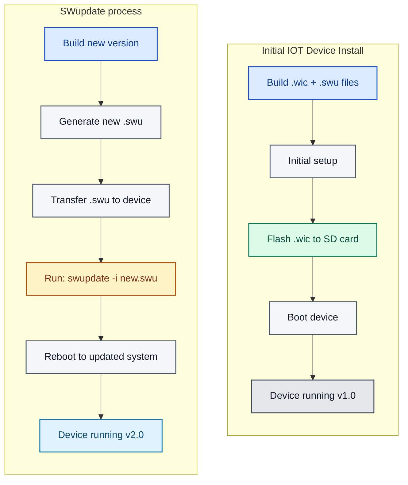

# DGAM-PR Additional Info

- Added kas/opt/gdam-pr.yml
- Use following command within this repo's highest directory depth
    - ` ./kas-container build kas-iot2050-swupdate.yml:./kas/opt/dgam-pr.yml`

## Copy via SCP from build server

Hereby an example on how to copy the file from the buildserver to your machine over ssh:

1. Create DIR on server you are gathering the files on: `mkdir ~/images`
2. Perform SSH Copy: `scp <username>@<buildserverip>:repos/meta-iot2050-DGAM-PR/build/tmp/deploy/images/iot2050/iot2050-image-swu-example-iot2050-debian-iot2050.{wic,swu} ~/images/` . You might have to put in your password for each file.
3. Your files should be on the server or machine you ssh'd from

## Start clean
To clean after you have performed a build, perform the below command:

```
./kas-container --isar clean
```

## Main Idea



## Location of build result

Location of build results and what they entail:

```
build/
├── tmp/
│   ├── deploy/
│   │   └── images/
│   │       └── iot2050/
│   │           ├── iot2050-image-swu-example-iot2050-debian-iot2050.wic     ← Main image
│   │           ├── iot2050-image-swu-example-iot2050-debian-iot2050.swu     ← Update package
│   │           ├── iot2050-image-swu-example-iot2050-debian-iot2050.wic.img ← Symlink
│   │           └── iot2050-image-swu-example-iot2050-debian-iot2050.wic.bmap← Block map
│   └── work/     ← Intermediate build files
└── sources/      ← Downloaded source repositories
```

## Flash to SD Card (or use Balena Etcher)
sudo dd if=build/tmp/deploy/images/iot2050/iot2050-image-swu-example-iot2050-debian-iot2050.wic of=/dev/mmcblk0 bs=4M oflag=sync

# Two Types of Images as per architecture

See internal architecture repo for more information.

## PLC Facing IOT1

Simply perform the default swupdate build without any (opt) additional options
`./kas-container build kas-iot2050-swupdate.yml`


## Internet Facing IOT2

Create a specific build for IOT2 that will run docker/kubesolo to manage it's containers in order to collect data

`./kas-container build kas-iot2050-swupdate.yml:./kas/opt/dgam-pr.yml`

- See [kas/opt/dgam-pr.yml](kas/opt/dgam-pr.yml) for the specifics on what we disable or install
- See [meta/recipes-app/kubesolo](meta/recipes-app/kubesolo) for the KubeSolo recipe
- See [meta/recipes-app/kubectl](meta/recipes-app/kubectl) for the kubectl recipe

### Recipe Location Requirements

Custom recipes (kubesolo, kubectl) must be placed in a properly configured BitBake layer:
- ✅ Correct: `meta/recipes-app/`
- ❌ Incorrect: `recipes-app/` (root level - not in any layer)

All recipes are located in the main `meta` layer under `meta/recipes-app/`:
- [meta/recipes-app/kubesolo](meta/recipes-app/kubesolo) - KubeSolo recipe
- [meta/recipes-app/kubectl](meta/recipes-app/kubectl) - kubectl recipe

### Filesystem Layout IOT2050
KubeSolo needs to write to writable Overlay Directories only. This is why you need to install the exec during image build.

```
/var/lib/kubesolo - Cluster data, certificates, configs
/var/log - Log files
/etc/kubesolo - Configuration files
/tmp - Temporary files
```

Filesystem Layout:
```
┌─────────────────────────────────────────┐
│ Read-Only Root (/)                      │
│ - /usr/bin/kubesolo ← Binary lives here │ ✅ Executable
│ - /bin, /lib, /etc (base)               │
├─────────────────────────────────────────┤
│ Writable Overlay Directories            │
│ - /var ← KubeSolo data storage          │ ✅ Writable
│ - /etc ← Configuration files            │ ✅ Writable
│ - /tmp ← Temporary files                │ ✅ Writable
│ - /home ← User data                     │ ✅ Writable
└─────────────────────────────────────────┘
```

### KubeSolo Systemd Service

The kubesolo service is automatically installed and configured to start on boot, but requires device-specific configuration before it will run successfully.

#### Service Configuration

The service is configured with:
- **Configuration file**: `/var/lib/kubesolo/config`
- **Service file**: `/usr/lib/systemd/system/kubesolo.service`
- **Validation script**: `/usr/bin/kubesolo-prestart.sh`

#### Automatic Retry Behavior

If configuration is missing or invalid:
1. ✅ Service retries every **60 seconds**
2. ⚠️ After **5 failed attempts** in a **10-minute window**, systemd stops retrying
3. 🛑 Service remains in failed state until configuration is provided or device is rebooted

This prevents resource waste while allowing time for initial configuration.

#### Per-Device Setup

After deploying the OS image to each IOT2050 device, configure device-specific settings:

```bash
# Edit the configuration file
vi /var/lib/kubesolo/config

# Uncomment and set your device-specific values:
KUBESOLO_PORTAINER_EDGE_ID=device-001
KUBESOLO_PORTAINER_EDGE_KEY=YmFzZTY0ZW5jb2RlZGtleQ==

# Start the service
systemctl start kubesolo

# Check status
systemctl status kubesolo
```

#### Configuration Details

The service configuration includes:
- **KUBECONFIG**: Set to `/var/lib/kubesolo/pki/admin/admin.kubeconfig`
- **Required variables**: `KUBESOLO_PORTAINER_EDGE_ID` and `KUBESOLO_PORTAINER_EDGE_KEY` must be set in `/var/lib/kubesolo/config`
- **Network dependency**: Service starts after network is online

#### Troubleshooting

```bash
# View service logs
journalctl -u kubesolo -f

# Check service status
systemctl status kubesolo

# Manually restart after configuration
systemctl restart kubesolo

# Reset failure counter (if service hit restart limit)
systemctl reset-failed kubesolo
```

# IOT2050 SWUpdate Usage Guide

## Overview
This guide explains when and how to use the SWUpdate files generated by the IOT2050 build system.

### File Types
File Extension	Purpose	When to Use
- .wic	Bootable disk image	Initial installation
- .swu	Update package	System updates

## Initial Installation

1. Flash Service Stick image to sd card
2. Inject SD card into Siemens IOT2050 device, this should boot to linux
  1. Default Password is root/root (Might have to change Password)
  2. If it does not boot from the SD Card do the following:
    1. Set Boot Target`load mmc 0:2 ${kernel_addr_r} linux.efi`
    2. Boot from set Target`bootefi ${kernel_addr_r}{fdtcontroladdr}` 
3. In Linux mount /sda/sda1 to /tmp/usb
	1. Create Dir: `sudo mkdir -p /tmp/usb`
	2. Mount Dir: `sudo mount -t ext4 /dev/sda1 /tmp/usb`
	3. CD into /tmp/usb with `cd /tmp/usb`
4. Flash from USB to EMMC (This can take a while)
	1. Run `sudo dd if=/path/to/new-image.wic of=/dev/mmcblk1 bs=4M status=progress conv=fsync`
	2. For Example: `sudo dd if=./iot2050-image-swu-example-iot2050-debian-iot2050.wic of=/dev/mmcblk1 bs=4M status=progress conv=fsync`
5. Then reboot `sudo reboot`

## System Updates

Use the .swu file to update an already running system:

### Method 1: Network Transfer

```
# Transfer update file to device
scp build/tmp/deploy/images/iot2050/iot2050-image-swu-example-iot2050-debian-iot2050.swu \
    root@192.168.200.1:/tmp/

# SSH into device
ssh root@192.168.200.1

# Apply update
swupdate -i /tmp/iot2050-image-swu-example-iot2050-debian-iot2050.swu

# Reboot to activate new system
reboot
```

### Method 2: USB Stick

```
# Copy .swu file to USB stick
# Insert USB into IOT2050
mount /dev/sda1 /mnt
swupdate -i /mnt/iot2050-image-swu-example-iot2050-debian-iot2050.swu
reboot
```

### Method 3: Direct Download
```
# On the IOT2050 device
wget https://your-update-server.com/updates/latest.swu -O /tmp/update.swu
swupdate -i /tmp/update.swu
reboot
```

## Confirming Updates

Important: After rebooting into the updated system, you must confirm the update:
```
# Test that the system works correctly
# Then confirm the update to make it permanent
complete_update.sh
```
⚠️ Warning: If you don't run complete_update.sh, the next reboot will roll back to the previous version!

## How SWUpdate Works

The system uses a dual-partition layout:
```
┌─────────────────────────────────────┐
│ Boot Partition                      │
├─────────────────────────────────────┤
│ Root Filesystem A (Active)          │ ← Currently running
├─────────────────────────────────────┤
│ Root Filesystem B (Inactive)        │ ← Update target
└─────────────────────────────────────┘
```

### Update process:

1. swupdate writes to the inactive partition
2. Bootloader switches to the updated partition on reboot
3. Previous partition becomes the backup for rollback

### Rollback Protection

If an update fails:
- Automatic: Device boots back to previous working version
- Manual: Reboot without running complete_update.sh

## Build Output Locations
After building with ./kas-container build kas-iot2050-swupdate.yml:<youroption>.yml:

```
build/tmp/deploy/images/iot2050/
├── iot2050-image-swu-example-iot2050-debian-iot2050.wic      ← Initial installation
├── iot2050-image-swu-example-iot2050-debian-iot2050.swu      ← Updates
├── iot2050-image-swu-example-iot2050-debian-iot2050.wic.bmap ← Block map for bmaptool
└── iot2050-image-swu-example-iot2050-debian-iot2050.wic.img  ← Symlink to .wic

```

## Quick Reference

### When to Use What

- First time setup: Use .wic file with dd or bmaptool
- System updates: Use .swu file with swupdate -i
- Never: Use .swu for initial installation

### Update Workflow

1. Build new version → generates .swu file
2. Transfer .swu to running device
3. Run swupdate -i filename.swu
4. Reboot device
5. Test system functionality
6. Run complete_update.sh to confirm

### Troubleshooting

- Update fails: Device automatically rolls back on next reboot
- System won't boot: Remove power, reinsert - should boot previous version
- Want to rollback: Simply reboot without running complete_update.sh

#### Check your image locally

Mount your image locally by doing the following:

1. Mount the Image: `sudo losetup -fP iot2050-image-swu-example-iot2050-advanced.wic`
2. Check what loop was added, probably loop 0 by doing `lsblk`
3. Create Dir to mount on `mkdir -p /mnt/yourimage`
4. Mount the partition you want to check: `sudo mount /dev/loop0p2 /mnt/yourimage`
5. Your Image is now mounted at `/mnt/yourimage`
6. Cleanup by doing 
  - `sudo umount /dev/loop0p2 /mnt/yourimage`
  - `sudo losetup -d /dev/loop0`

#### Clear/Clean the EMMC from IOT2050

1. Check the EMMC, should be 1 (0 = Flash) by `mmc list`
2. Select EMMC 1 by `mmc dev 1`
3. TO DO...

#### Mount SD Card if EFI does not work

1. Load bootpartition for example 0:2 -> `load mmc 0:2 ${kernel_addr_r} linux.efi`
2. Boot that partition `bootefi ${kernel_addr_r}{fdtcontroladdr}`

# U-Boot

U-Boot is a popular open-source bootloader used in embedded Linux systems, responsible for initializing hardware and loading the operating system kernel. It supports various architectures and can boot from multiple devices like SD cards and USB drives.

Check and read: recipes-bsp/u-boot/README.md

Docs U-Boot: https://docs.u-boot.org/en/latest/
Specific Docs: https://docs.u-boot.org/en/latest/board/siemens/iot2050.html#


## IOT2050 Firmware Update – Short Procedure

Everything to download can be found here: 
https://support.industry.siemens.com/cs/document/109741799/downloads-for-simatic-iot20x0?dti=0&lc=en-WW

#### Prerequisites

- Service stick / example image for IOT2050  
- Firmware update files from Siemens or from KAS build/tmp/deploy/iot2050/ directory:
  - `iot2050-firmware-update_<version>_arm64.deb`
  - `IOT2050-FW-Update-PKG-V01.xx.xx-<hash>.tar.xz`  
- Network access to a Debian mirror (for `apt`)

---

### 1. Prepare Files on the IOT2050

On your PC, download the firmware update tool and package from Siemens, then copy them to a USB Stick:

- A USB Stick only containing these files, not the same stick as the USB Stick you use to install service-stick siemens Industrial OS to eMMC.
- Make sure to copy both the .deb and the .tar.xz from either your siemens download or your KAS build/tmp/deploy/iot2050/ directory (this one is preferred as it fits the image you will eventually run)
  - Use the following standard example build to get the latest firmware files: `./kas-container build ./kas-iot2050-example.yml`

---

### 2. Boot Service Stick and Install OS to eMMC

1. Boot the IOT2050 from the **service stick/example image**.
  0. Insert USB Stick
  1. Interrupt the boot process to get into u-boot upon starting the device
  2. following commands
    1. `setenv devnum 0` <- bootcmd_usb0=devnum=0; run usb_boot
    2. `run bootcmd_usb0` <- usb_boot=usb start; if usb dev ${devnum}; then devtype=usb; run scan_dev_for_boot_part; fi
2. Use the menu to **install the OS to eMMC** (Advanced PG2).
  1. `Important:` Make sure to install an APT Mirror and also select the development packages!!!
3. Reboot so the device runs from the freshly installed OS on eMMC.

---

### 3. Configure Debian Mirror and Install Dependencies

1. Configure `/etc/apt/sources.list` with a valid Debian mirror (as per Siemens example image/service stick).
2. Update package lists and install required packages:

```bash
apt update # Loads all the info (Do NOT apt Upgrade!)
apt install python3-progress
apt install python3-packages
```

(Install additional dev / Python packages if required by your environment.)

---

### 4. Ensure `/etc/os-release` Contains Required Keys

Sometimes the BUILD_ID is missing, and the firmware update requires BUILD_ID derrived from /etc/os-release

> Note: The Siemens update script reads `BUILD_ID` (and possibly other keys) from `/etc/os-release`. Missing keys will cause a Python `KeyError`.

0. Inspect `/etc/os-release`:

```bash
cat /etc/os-release
```

If that file does not contain BUILD_ID, add it as follows below, else ignore the steps.

1. Check current firmware information (depending on image):

```bash
fw_printenv fw_version
# Example output: fw_version=2025.04-V01.05.01-80-gfe007f1
```

2. Export the trimmed variable

```bash
CURRENT_VER=$(fw_printenv fw_version | cut -d'-' -f2)
```

3. Add to /etc/os-release

```bash
echo "BUILD_ID=$CURRENT_VER" >> /etc/os-release
```

The file /etc/os-release should now hold the current firmware version in the form of BUILD_ID

---

### 5. Install Firmware Update Tool

```bash
#Insert USB Stick that has the latest firmware files, mount it and copy it to ~
mkdir /tmp/usb
sudo mount /dev/sda1 /tmp/usb #could be sdb1 if you have both usb sticks plugged in
cp -R /tmp/usb/firmware ./
cd ~/firmware

# Remove any old version
dpkg -r iot2050-firmware-update || true

# Install new tool
dpkg -i firmware-update-package-iot2050-firmware-update_arm64.deb
apt -f install
```

---

### 6. Run Firmware Update

From `~/firmware/`

```bash
iot2050-firmware-update IOT2050-FW-Update-PKG-<Your Version>
```

During the process:

1. Confirm the warning that the device may become unbootable (`Y`).
2. When prompted, choose whether to:
   - keep the current boot order (`Y`), or
   - reset to defaults (`n`), according to your setup / Siemens guidance.
3. Allow the device to reboot when the tool finishes.

---

### 7. Verify Firmware Version

After reboot:

```bash
fw_printenv fw_version
```

Confirm that the reported firmware version matches the firmware package you installed.