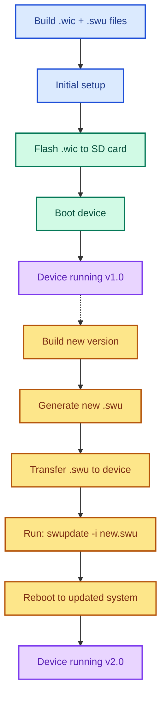

# GDAM-PR Additional Info

- Added kas/opt/pro-rail.yml
- Use following command within this repo's highest directory dept
    - ` ./kas-container build kas-iot2050-swupdate.yml:./kas/opt/dgam-pr.yml`

## Main Idea



## Location of build result

Location of build results and what tehy entail:

```
build/
├── tmp/
│   ├── deploy/
│   │   └── images/
│   │       └── iot2050/
│   │           ├── iot2050-image-swu-example-iot2050-debian-iot2050.wic     ← Main image
│   │           ├── iot2050-image-swu-example-iot2050-debian-iot2050.swu     ← Update package
│   │           ├── iot2050-image-swu-example-iot2050-debian-iot2050.wic.img ← Symlink
│   │           └── iot2050-image-swu-example-iot2050-debian-iot2050.wic.bmap← Block map
│   └── work/     ← Intermediate build files
└── sources/      ← Downloaded source repositories
```

## Flash to SD Card (or use Balena Etcher)
sudo dd if=build/tmp/deploy/images/iot2050/iot2050-image-swu-example-iot2050-debian-iot2050.wic of=/dev/mmcblk0 bs=4M oflag=sync


# IOT2050 SWUpdate Usage Guide

## Overview
This guide explains when and how to use the SWUpdate files generated by the IOT2050 build system.

### File Types
File Extension	Purpose	When to Use
- .wic	Bootable disk image	Initial installation
- .swu	Update package	System updates

## Initial Installation

- Use the .wic file for first-time setup:
```
# Flash to SD card
sudo dd if=build/tmp/deploy/images/iot2050/iot2050-image-swu-example-iot2050-debian-iot2050.wic \
        of=/dev/mmcblk0 bs=4M oflag=sync

OR

# Use an Application like BalenaEtcher that supports .wic files
```
- Insert the SD card into your IOT2050 device and boot.
- Move SD Cart content to EMMC.

## System Updates

Use the .swu file to update an already running system:

### Method 1: Network Transfer

```
# Transfer update file to device
scp build/tmp/deploy/images/iot2050/iot2050-image-swu-example-iot2050-debian-iot2050.swu \
    root@192.168.200.1:/tmp/

# SSH into device
ssh root@192.168.200.1

# Apply update
swupdate -i /tmp/iot2050-image-swu-example-iot2050-debian-iot2050.swu

# Reboot to activate new system
reboot
```

### Method 2: USB Stick

```
# Copy .swu file to USB stick
# Insert USB into IOT2050
mount /dev/sda1 /mnt
swupdate -i /mnt/iot2050-image-swu-example-iot2050-debian-iot2050.swu
reboot
```

### Method 3: Direct Download
```
# On the IOT2050 device
wget https://your-update-server.com/updates/latest.swu -O /tmp/update.swu
swupdate -i /tmp/update.swu
reboot
```

## Confirming Updates

Important: After rebooting into the updated system, you must confirm the update:
```
# Test that the system works correctly
# Then confirm the update to make it permanent
complete_update.sh
```
⚠️ Warning: If you don't run complete_update.sh, the next reboot will roll back to the previous version!

## How SWUpdate Works

The system uses a dual-partition layout:
```
┌─────────────────────────────────────┐
│ Boot Partition                      │
├─────────────────────────────────────┤
│ Root Filesystem A (Active)          │ ← Currently running
├─────────────────────────────────────┤
│ Root Filesystem B (Inactive)        │ ← Update target
└─────────────────────────────────────┘
```

### Update process:

1. swupdate writes to the inactive partition
2. Bootloader switches to the updated partition on reboot
3. Previous partition becomes the backup for rollback

### Rollback Protection

If an update fails:
- Automatic: Device boots back to previous working version
- Manual: Reboot without running complete_update.sh

## Build Output Locations
After building with ./kas-container build kas-iot2050-swupdate.yml:<youroption>.yml:

build/tmp/deploy/images/iot2050/
├── iot2050-image-swu-example-iot2050-debian-iot2050.wic      ← Initial installation
├── iot2050-image-swu-example-iot2050-debian-iot2050.swu      ← Updates
├── iot2050-image-swu-example-iot2050-debian-iot2050.wic.bmap ← Block map for bmaptool
└── iot2050-image-swu-example-iot2050-debian-iot2050.wic.img  ← Symlink to .wic

## Quick Reference

### When to Use What

- First time setup: Use .wic file with dd or bmaptool
- System updates: Use .swu file with swupdate -i
- Never: Use .swu for initial installation

### Update Workflow

1. Build new version → generates .swu file
2. Transfer .swu to running device
3. Run swupdate -i filename.swu
4. Reboot device
5. Test system functionality
6. Run complete_update.sh to confirm

### Troubleshooting

- Update fails: Device automatically rolls back on next reboot
- System won't boot: Remove power, reinsert - should boot previous version
- Want to rollback: Simply reboot without running complete_update.sh